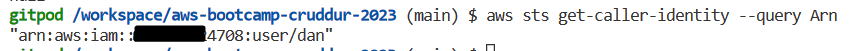
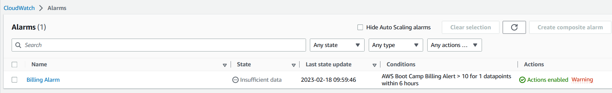
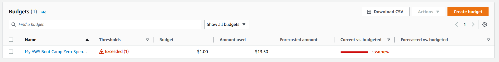

# Week 0 — Billing and Architecture

## Required Homework

Watched all required Week 0 videos and completed checklist

Created conceptual diagram in Lucid Charts
    https://lucid.app/lucidchart/d1b41424-d208-4c8d-8e7b-4603b978a57a/edit?viewport_loc=-295%2C-18%2C2389%2C1148%2C0_0&invitationId=inv_af3f268b-7f5f-4140-aecf-d93f14c86622

Created logical architectural diagram in Lucid Charts
    https://lucid.app/lucidchart/dc68d536-892f-4699-baa6-1a02976b433d/edit?viewport_loc=-109%2C50%2C2738%2C1316%2C0_0&invitationId=inv_98b9474a-286d-41fd-96a4-bfc334be5043

### Successfully utilized Github and Gitpod to install AWS CLI

### Created a Billing Alarm

### Created a Budget

